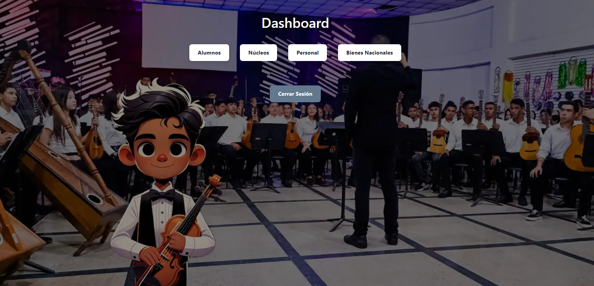
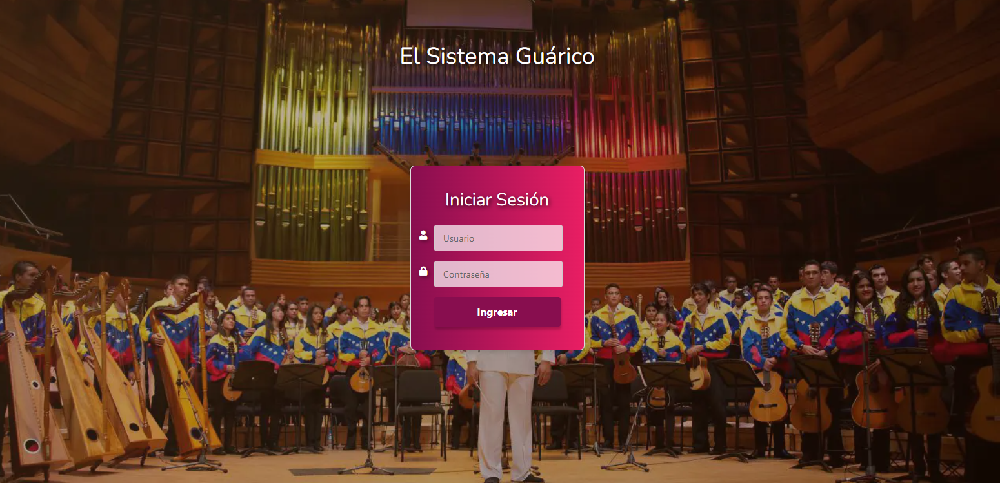
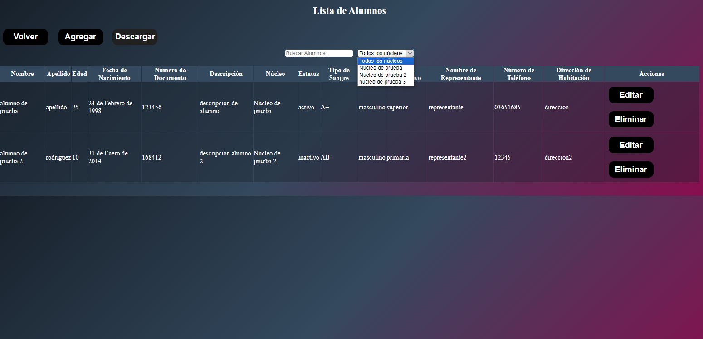

# El Sistema Guárico - Sistema de Gestión Orquestal

El Sistema Guárico es una aplicación web desarrollada para el sistema de orquestas juvenil del estado Guárico, con el propósito de administrar eficientemente la información de alumnos, bienes e instrumentos, personal y núcleos.

## Características

- Gestión de alumnos, bienes, instrumentos, y personal.
- Autenticación de usuarios con sistema de rangos.
- Operaciones CRUD (Crear, Leer, Actualizar, Eliminar).
- Filtrado de visualizaciones según permisos de usuario.
- Generación de reportes en formato CSV.

## Tecnologías

- **Backend**: Python, Django
- **Frontend**: HTML, CSS, JavaScript
- **Base de Datos**: MySQL
- **Despliegue**: PythonAnywhere

## Vista Previa de la Aplicación

*Página de inicio de sesión.*

*Lista de alumnos con opciones para editar y eliminar.*

## Comenzando

Estas instrucciones te proporcionarán una copia del proyecto en funcionamiento en tu máquina local para propósitos de desarrollo y pruebas.

### Prerrequisitos

Qué cosas necesitas para instalar el software:

Python 3.8+
Django 5.0.1+
Una instancia de MySQL

### Instalación

Un paso a paso de cómo poner en marcha el entorno de desarrollo:

Clona el repositorio:

git clone https://github.com/eljega/el-sistema.git

Instala las dependencias:

pip install -r requirements.txt

Configura tu base de datos MySQL en `settings.py` y ejecuta las migraciones:

python manage.py migrate

Ejecuta el servidor de desarrollo:

python manage.py runserver

## Uso

Para acceder a la aplicación, navega a `http://localhost:8000/` en tu navegador.

## Seguridad

Las siguientes medidas de seguridad han sido implementadas en el proyecto:

- Uso de variables de entorno para credenciales sensibles.
- Configuraciones de seguridad reforzadas en `settings.py` para producción.
- Autenticación de usuarios y sistema de permisos para controlar el acceso.

## Versionado

Utilizamos [SemVer](http://semver.org/) para el versionado.

## Autores

- **Mi Nombre** - *Trabajo Inicial* - [eljega](https://github.com/eljega)

